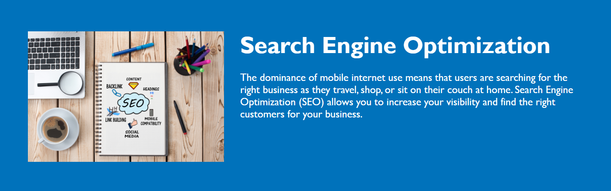

# Refactoring Horiseon Web Page

## Description
The motivation behind this project was to refactor and edit the code of the Horiseon Social Solution Services web page to make it more accessible for potential users who have disabilities and utilise the functionality of a screen reader. In addition to this, the aim was to "tidy" up the code and make it more concise and readable for other developers who potentially may access this page. Furthermore, a by-product of this activity is that a fully accessible webpage will increase performance on search engines, reaching a wider audience. Throughout this project/challenge, I have learnt how to use semantic HTML and the best practices that come along with this as well as using appropriate CSS Selectors to keep code concise.

#

## Table Of Contents
- [Usage](#usage)
- [Credits](#credits)
- [Deployment](#deployment)
- [License](#license)

#

## Usage
The Horiseon web page has three main navigational links:
- Search Engine Optimization
- Online Reputation Management
- Social Media Marketing

This can be seen in the screenshot below:

When each navigational link is clicked, the user is taken to the corresponding section of the webpage as shown below:

#

## Credits
Throughout working on this project/challenge, I sought the knowledge and advice from multiple sources including:

- https://www.w3schools.com/css/css_comments.asp
- https://accessibility.iu.edu/creating-content/web-content/titles.html
- https://developer.mozilla.org/en-US/docs/Web/HTML/Element/Heading_Elements
- https://developer.mozilla.org/en-US/docs/Learn/HTML/Introduction_to_HTML/Document_and_website_structure
- https://www.freecodecamp.org/news/semantic-html5-elements/#:~:text=Semantic%20HTML%20elements%20are%20those,content%20that%20is%20inside%20them.
- https://html.com/semantic-markup/
- https://www.w3schools.com/html/html_accessibility.asp

#

## Deployment
Below is the link to the deployed web page using GitHub Pages:

- https://maccersm8.github.io/Horiseon-Refactor/

#

## License

Copyright (c) 2022 Maisie McDonald

Permission is hereby granted, free of charge, to any person obtaining a copy
of this software and associated documentation files (the "Software"), to deal
in the Software without restriction, including without limitation the rights
to use, copy, modify, merge, publish, distribute, sublicense, and/or sell
copies of the Software, and to permit persons to whom the Software is
furnished to do so, subject to the following conditions:

The above copyright notice and this permission notice shall be included in all
copies or substantial portions of the Software.

THE SOFTWARE IS PROVIDED "AS IS", WITHOUT WARRANTY OF ANY KIND, EXPRESS OR
IMPLIED, INCLUDING BUT NOT LIMITED TO THE WARRANTIES OF MERCHANTABILITY,
FITNESS FOR A PARTICULAR PURPOSE AND NONINFRINGEMENT. IN NO EVENT SHALL THE
AUTHORS OR COPYRIGHT HOLDERS BE LIABLE FOR ANY CLAIM, DAMAGES OR OTHER
LIABILITY, WHETHER IN AN ACTION OF CONTRACT, TORT OR OTHERWISE, ARISING FROM,
OUT OF OR IN CONNECTION WITH THE SOFTWARE OR THE USE OR OTHER DEALINGS IN THE
SOFTWARE.

#